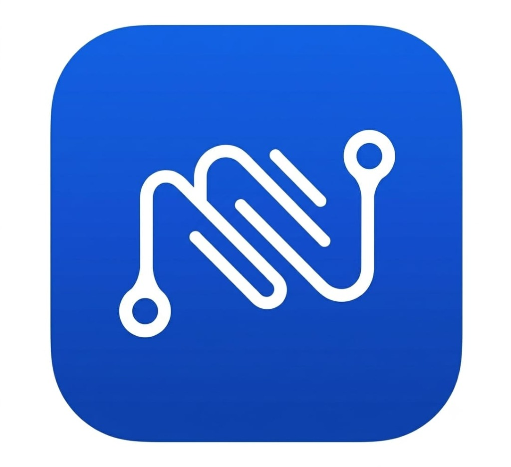

# NextRide — Coming Soon Landing Page

> **"Your next ride, on time, every time"**

NextRide is building a reliable shared mobility network that makes everyday travel more predictable, accessible, and convenient. Launching first in Bareilly, Uttar Pradesh with the pilot route **Bypass → Bhojipura**.



---

## 🚀 Key Brand & Platform Highlights

- **Official Brand Name**: `NextRide`
- **Official Tagline**: `"Your next ride, on time, every time"`
- **Exact Official Logo**: Integrated directly from the official brand asset without modification or distortion.
- **Brand Style**:
  - Primary Brand Blue: Electric Royal Blue (`#1258D4` / `#0D4BB8`)
  - Main Background: Crisp White `#FFFFFF` with Slate Neutrals (`#F8FAFC`, `#0F172A`)
  - Subtle dark navy accents and clean route gradients
  - Minimal, trustworthy, reliable, and futuristic aesthetic
- **Pilot Route**:
  - **Bypass → Bhojipura**
  - **Bareilly, Uttar Pradesh, India**
- **Founding Team**:
  - **Paras Gangwar** — Cofounder & CTO
  - **Saurabh** — Cofounder & CEO

---

## 🌐 Live Landing Page Sections

1. **Sticky Header / Navbar**: Exact NextRide logo, navigation links (*Home*, *How It Works*, *Why NextRide*, *Coming Soon*), pilot route beacon, and "Join Waiting List" CTA.
2. **Hero Section**:
   - Small Badge: `COMING SOON • BAREILLY`
   - Headline: `Your next ride, on time, every time.`
   - Supporting text on building a predictable shared mobility network.
   - Interactive route visual connecting **Bypass → Bhojipura** matching the NextRide logo.
   - `Launching first in Bareilly, Uttar Pradesh`
3. **What is NextRide?**:
   - Heading: `Mobility should be predictable.`
   - 3 core concept cards:
     - **01 — Know Your Route**: Clear routes and designated stops.
     - **02 — Know Your Time**: Published schedules designed around real travel needs.
     - **03 — Know Your Ride**: Ride information, booking and service updates in one place.
4. **How It Works**:
   - Heading: `Your ride, simplified.`
   - 4-step flow: *Choose your route* → *Select your stop and departure* → *Request your ride* → *Ride with confidence*.
   - Connected with subtle animated route lines.
5. **First Pilot Route**:
   - Section: `Our first route`
   - Highlight: `Bypass → Bhojipura` (Bareilly, Uttar Pradesh).
   - Minimalist route visualization.
6. **Why NextRide**:
   - 4 premium feature cards: *Reliable*, *Accessible*, *Simple*, *Connected*.
7. **Coming Soon / Waiting List**:
   - Large Headline: `Be among the first to ride with NextRide.`
   - Fields: Full Name, 10-digit Indian Mobile Number, Email Address (optional), Commuter/Driver preference.
   - Polished Success State: *“You’re on the list.”* / *“We’ll let you know when NextRide is ready for you.”*
   - Duplicate prevention, Supabase cloud sync, and fallback local queue with CSV export.
8. **Founder Section**:
   - `Built by the Founders`: Paras Gangwar (CTO) and Saurabh (CEO).
9. **Footer**:
   - NextRide logo, tagline, navigation, Privacy Policy & Terms modals, and `© 2026 NextRide. All rights reserved.`.

---

## 🛠️ Tech Stack & Architecture

- **Framework**: React 19 + TypeScript + Vite 8
- **Styling**: Tailwind CSS v4 + Plus Jakarta Sans & Inter
- **Icons**: Lucide React
- **Cloud Database**: Supabase (`@supabase/supabase-js`)
- **Version Control**: Git + GitHub (`main` branch)
- **Deployment Platform**: Vercel ready (`vercel.json`)

---

## 🔗 Platform Integrations

### 1. GitHub Connection
The repository is tracked on branch `main` and pushed to:
```
https://github.com/parasgangwar248-eng/NextRide.git
```

To push updates at any time:
```powershell
.\push-to-github.ps1
```
Or via standard Git commands:
```bash
git add .
git commit -m "update: landing page improvements"
git push origin main
```

---

### 2. Supabase Database Connection
Waiting list submissions are automatically synchronized with Supabase.

1. Create a project at [supabase.com](https://supabase.com).
2. Go to the **SQL Editor** in Supabase and run the migration in [`supabase/migrations/20261007_waiting_list.sql`](./supabase/migrations/20261007_waiting_list.sql):
   ```sql
   CREATE TABLE IF NOT EXISTS public.waiting_list (
       id UUID PRIMARY KEY DEFAULT gen_random_uuid(),
       full_name TEXT NOT NULL,
       mobile_number TEXT NOT NULL UNIQUE,
       email TEXT,
       interest_type TEXT DEFAULT 'commuter',
       route_interest TEXT DEFAULT 'Bypass → Bhojipura',
       source TEXT DEFAULT 'web_coming_soon_landing',
       created_at TIMESTAMPTZ DEFAULT TIMEZONE('utc'::text, NOW()) NOT NULL
   );

   ALTER TABLE public.waiting_list ENABLE ROW LEVEL SECURITY;

   CREATE POLICY "Allow public inserts" ON public.waiting_list 
   FOR INSERT TO anon, authenticated WITH CHECK (true);

   CREATE POLICY "Allow public select" ON public.waiting_list 
   FOR SELECT TO anon, authenticated USING (true);
   ```
3. Set your credentials in `.env`:
   ```env
   VITE_SUPABASE_URL=https://your-project-id.supabase.co
   VITE_SUPABASE_ANON_KEY=your-anon-public-key
   ```
4. *Fallback Storage*: Even before configuring Supabase keys, all submissions are safely captured in local storage and can be exported as a CSV file via the in-app Integrations modal!

---

### 3. Vercel Deployment
Pre-configured with `vercel.json` for single-page routing and caching.

#### Deploy via GitHub (Recommended):
1. Visit [vercel.com/new](https://vercel.com/new).
2. Import `parasgangwar248-eng/NextRide`.
3. Add environment variables `VITE_SUPABASE_URL` and `VITE_SUPABASE_ANON_KEY` if configured.
4. Click **Deploy**. Future pushes to `main` will automatically deploy live!

#### Deploy via Vercel CLI:
```bash
npx vercel --prod
```

---

## 💻 Running Locally

```bash
# 1. Install packages
npm install

# 2. Run local development server
npm run dev

# 3. Preview production build
npm run build
npm run preview
```
Visit `http://localhost:5173/` in your browser.
